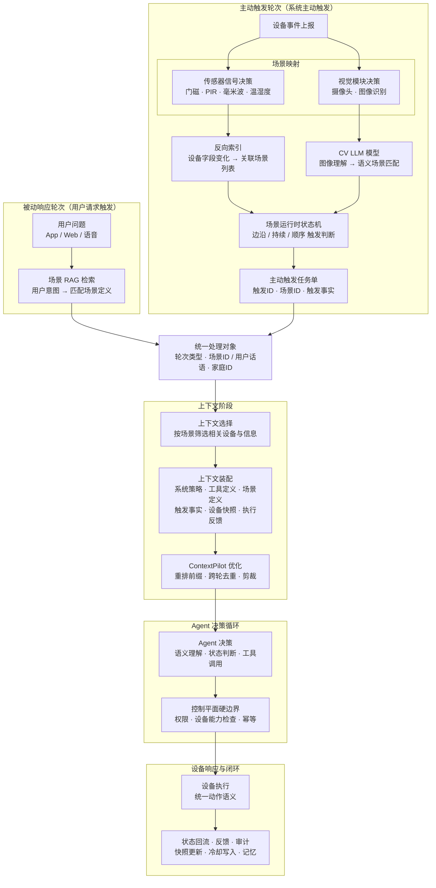

  

## 1. 背景与问题

  

在智能家居场景里，系统需要同时处理两类请求：

  

- 用户主动发起的请求，比如“把客厅灯打开”

- 系统根据环境变化主动发起的处理，比如“有人进门时自动开灯”

  

传统做法通常会把主动触发做成一套通用规则引擎。这样当然能工作，但很快会遇到三个问题：

  

1. 业务心智和系统实现脱节

  

用户和产品想的是“进门开灯”“无人断电”，系统实现里却是 `contact`、`occupancy`、`window`、`all_of` 这类底层条件组合。讨论成本高，修改成本也高。

  

2. 运行时效率不理想

  

每条设备上报都可能触发大范围规则扫描，而真正和当前事件相关的规则其实只占很小一部分。

  

3. Agent 难以直接承接底层协议

  

如果把原始 Zigbee 字段、传感器抖动、时间窗口这些复杂细节都直接扔给 Agent，Agent 很难稳定决策，后端也难以保证可控性。

  

因此，我们需要一种新的组织方式：既保留自动化能力，又让架构更贴近业务表达，并且天然适合 Agent 接入。

  

## 2. 设计目标

  

本方案的目标有五个：

  

1. 让系统以“场景”而不是“零散规则”为核心组织业务能力。

2. 让主动触发和用户请求在中后段共享同一条 Agent 主干。

3. 让 Agent 处理语义化任务，而不是底层设备协议细节。

4. 让控制、权限、幂等、执行等高风险逻辑继续留在后端硬边界内。

5. 让上下文组织更稳定，便于 ContextPilot 做缓存优化和 token 剪裁。

  

非目标也很明确：

  

- 不追求把所有自动化都做成纯大语言模型（LLM）决策。

- 不让 Agent 直接控制设备。

- 不在第一版就支持无限复杂的通用规则表达语法（DSL）。

  

## 3. 核心思路

  

这套架构的核心思路可以浓缩成一句话：

  

> 先由后端把设备世界组织成“场景（Scene）”，再把命中的场景交给 Agent 做理解、确认和执行。

  

也就是说，系统先做两层分工：

  

- 第一层是**场景层**：负责理解“什么情况算进门”“什么情况算无人”“什么设备和这个场景有关”

- 第二层是**Agent 层**：负责在场景已经命中的前提下，结合当前状态判断“要不要执行”“要执行什么”“是否需要确认”

  

这样做以后：

  

- 业务同学看到的是场景

- 后端同学维护的是场景运行时状态

- Agent 同学面对的是语义化上下文

- 设备层继续只关心协议和执行

  

## 4. 总体架构

  

整体上，这套系统采用“**双入口，单主干**”设计。

  

- 主动入口：设备状态变化触发场景

- 被动入口：用户通过 App、Web、语音等渠道发出请求

- 两种入口在进入统一主干后，共享上下文选择、Agent 决策、控制平面和设备执行能力

  



  

为了方便理解，可以把整条链路分成五段：

  

1. **触发段**：设备事件进入系统，被路由到相关场景

2. **建模段**：场景命中后，被转成一个统一的处理对象

3. **上下文段**：系统为这次处理选择和装配必要上下文

4. **决策段**：Agent 使用工具做确认、判断和执行

5. **闭环段**：结果回流，写入状态、反馈、记忆和审计

  

## 5. 核心概念

  

### 5.1 Scene（场景）

  

Scene 是整个方案的核心业务单元。一个 Scene 需要回答五个问题：

  

1. 它关心哪些设备。

2. 它在什么条件下算“命中”。

3. 命中后要把哪些设备状态带进上下文。

4. 命中后建议执行什么动作。

5. 它有哪些运行策略，比如 cooldown、优先级、冲突处理。

  

可以把 Scene 理解成：

  

> 一个可执行的业务场景定义，而不是一条孤立的 if-then 规则。

  

### 5.2 Trigger（触发条件）

  

Trigger 描述 Scene 如何被激活。它不是单一形状，可以有多种模式：

  

- `edge_triggered`：边沿触发，比如门磁开了、人体传感器从“没人”变成“有人”

- `duration_triggered`：持续触发，比如连续 10 分钟无人

- `sequential`：顺序触发，比如先开门，再有人进入

- `windowed_all`：窗口内多条件同时凑齐

  

### 5.3 Context Devices（上下文设备）

  

Context Devices 表示：场景命中后，哪些设备的最新状态需要被带给 Agent。

  

这里有一个非常重要的区分：

  

- 有些设备参与触发判断

- 有些设备不参与触发，但对执行判断很重要

  

例如“进门自动开灯”里：

  

- 门磁和人体红外移动传感器参与触发

- 灯当前是否已经打开、环境光是否足够暗，也可能决定最终要不要执行

  

这里的“人体红外移动传感器”，对应很多智能家居文档里常写的 `PIR`。如果不熟悉这个缩写，可以直接把它理解成“检测人体移动的红外传感器”。

  

### 5.4 Actions Hint（动作建议）

  

Actions Hint 是给 Agent 的动作建议，而不是硬编码命令。

  

它的价值在于：

  

- 后端可以明确告诉 Agent，“正常情况下你大概率要做什么”

- Agent 仍然可以结合实时状态决定执行或跳过

- 最终设备动作仍然要通过控制平面校验和下发

  

### 5.5 Runtime State（运行时状态）

  

每个 Scene 在运行时都会持有自己的状态机数据，例如：

  

- 最近一次观察到的字段值 `last_values`

- 顺序匹配的游标 `cursor`

- 计时起点 `condition_satisfied_since`

- 冷却截止时间 `cooldown_until`

  

这保证了同一个设备事件在不同 Scene 中可以有不同解释。

  

## 6. 关键设计原则

  

### 6.1 业务场景优先

  

系统先建模“进门开灯”“无人断电”这类业务单元，再考虑底层字段如何表达。

  

### 6.2 结构化优先

  

主动触发进入 Agent 时，输入应该以 `trigger + facts + snapshots` 这类结构化数据为主，而不是临时拼一句自然语言提示。

  

### 6.3 后端硬边界

  

以下能力不交给 Agent 自由发挥：

  

- 权限判断

- 设备能力检查

- 幂等控制

- 执行编排

- 安全限制

  

### 6.4 稳定上下文优先

  

模型输入上下文的大框架尽量稳定，动态内容按块组织，这样更适合 ContextPilot 做缓存优化。

  

### 6.5 统一设备协议

  

设备层对上只暴露统一动作语义，比如 `turn_on`、`turn_off`、`set_temperature`，不把 Zigbee、蓝牙、厂商私有协议直接暴露给 Agent。

  

## 7. 核心数据对象

  

这一节只介绍最关键的几个对象，目的是帮助理解整体链路，而不是在此处穷举全部字段。

  

### 7.1 Device Snapshot（设备状态快照）

  

Device Snapshot 来自设备网关的全量或增量状态快照。典型字段包括：

  

- `local_id`

- `ieee_address`

- `friendly_name`

- `payload`

- `timestamp`

  

其中 `payload` 是设备真实状态，字段由设备类型决定。例如：

  

- 门磁关心 `payload.contact`

- 人体红外移动传感器关心 `payload.occupancy`

- 毫米波关心 `payload.presence` 和 `payload.illuminance`

- 开关关心 `payload.state`

  

### 7.2 Scene Definition（场景定义）

  

一个 Scene 至少要包含：

  

- `scene_id`

- `name`

- `kind`

- `trigger`

- `context_devices`

- `intent`

- `actions_hint`

- `policy`

  

### 7.3 Trigger Event（触发事件对象）

  

当 Scene 命中后，系统不会直接调用 Agent，而是先产出一个结构化的 `proactive trigger`。它通常包含：

  

- `trigger_id`

- `home_id`

- `scene_id`

- `triggered_at`

- `source_event_ids`

- `facts`

  

这个对象的意义是：

  

- 让主动入口和被动入口在统一主干里拥有相似的输入形态

- 让后续链路知道“这次为什么被唤起”

  

### 7.4 Turn（统一处理对象）

  

Turn 是统一主干处理的标准输入对象。你可以把它理解成“系统处理一次请求或一次主动触发时使用的统一包裹对象”。无论来自用户，还是来自主动触发，最终都会被组织成 turn。

  

一个 turn 至少会有：

  

- `turn_id`

- `thread_type`

- `conversation_id`

- `home_id`

- `user_id`

- `source`

- `scene_id` 或 `utterance`

- `input`

  

## 8. 主动触发链路设计

  

### 8.1 反向索引

  

反向索引可以先用一句最直白的话理解：

  

> 它就是一张“某个设备的某个字段变化了，应该通知哪些场景”的查找表。

  

为什么叫“反向”？

  

- 正向想法通常是：一个场景关心哪些设备

- 反向索引则反过来存：一个设备字段变化时，哪些场景关心它

  

这样做是为了避免每来一条设备事件，都把所有场景扫一遍。

  

反向索引的形状通常是：

  

```text

(device, field) -> [{scene, role}]

```

  

意思是：

  

- `device`：设备 ID

- `field`：这个设备上的具体字段

- `scene`：关心这个字段的场景

- `role`：这个字段在场景里扮演什么角色

  

`role` 一般有两种：

  

- `trigger`：这个字段会参与场景触发判断

- `context_only`：这个字段只更新最新状态，不会单独触发场景

  

可以用“进门自动开灯”举个最简单的例子：

  

```text

(door_sensor_1, payload.contact)

-> [{scene: entry_auto_light_v1, role: trigger}]

  

(entry_pir_1, payload.occupancy)

-> [{scene: entry_auto_light_v1, role: trigger}]

  

(switch_entry_light, payload.state)

-> [{scene: entry_auto_light_v1, role: context_only}]

```

  

这张表表达的意思是：

  

- 如果门磁状态变了，就去看“进门自动开灯”这个场景

- 如果人体红外移动传感器状态变了，也去看这个场景

- 如果玄关灯开关状态变了，只更新它的最新状态，不因为这件事触发“进门自动开灯”

  

设备事件到来后，系统的处理顺序就是：

  

1. 先拿这条事件的 `(device, field)` 去查反向索引

2. 找到所有相关场景

3. 如果 `role = context_only`，只更新快照

4. 如果 `role = trigger`，才把这条事件送进场景的判断逻辑

  

这里最容易误解的一点是：

  

> 反向索引本身不负责判断“场景是否命中”。

> 它只负责快速找到“哪些场景值得看一眼”。

  

真正判断场景是否命中，靠的是场景自己的触发条件和运行时状态。

  

还是用“进门自动开灯”举例：

  

1. 门磁事件到来：`door_sensor_1.payload.contact: true -> false`

系统查反向索引，发现 `entry_auto_light_v1` 关心它。

于是把这条事件送进这个场景。

场景判断：这符合“先开门”这一步，所以把顺序游标往前推进。

  

2. 过了 2 秒，人体红外移动传感器事件到来：`entry_pir_1.payload.occupancy: false -> true`

系统再次查反向索引，还是命中 `entry_auto_light_v1`。

场景判断：这符合“30 秒内检测到人”这一步。

  

3. 场景再检查附加条件

比如当前光线是不是够暗，玄关灯是不是还没开。

  

4. 如果这些条件都满足，才算这个场景真正命中。

  

所以可以把整件事拆成两层理解：

  

- 反向索引负责“找到候选场景”

- 场景运行时状态机负责“判断是否真的命中”

  

### 8.2 Scene Runtime（场景运行时状态）

  

每个场景在系统里都要保存一份自己的运行状态，你可以把它理解成这个场景的“小本子”。

  

这个“小本子”用来记录：当前进行到哪一步了，是否已经满足触发条件，是否还在冷却时间内。

  

常见有三类：

  

- `edge_triggered`：刚发生变化就触发。比如门刚打开、人体传感器刚检测到人。

- `duration_triggered`：条件持续一段时间才触发。比如连续 10 分钟没人。

- `sequential`：几个条件按顺序发生才触发。比如先开门，再检测到人。

  

### 8.3 命中后的输出

  

当 Scene 命中后，Dispatcher 不直接操心“开灯”这类具体动作，而是先做两件更基础的事：

  

1. 生成一个主动触发任务对象，也就是 `proactive trigger`

你可以把它理解成一张发给后续链路的“内部任务单”。

它会说明：是哪个场景命中了、什么时候命中的、由哪些设备事件触发、当前已经确认了哪些事实。

  

2. 记录或更新这个场景自己的内部状态

最常见的就是写入 `cooldown_until`，表示“这个场景在某个时间点之前不要再重复触发”。

例如“进门自动开灯”刚刚已经触发过了，那么接下来 60 秒内，就不要因为人体传感器连续上报而重复开灯。

  

可以把这两步分别理解成：

  

- 对外：发出“现在该处理这次场景了”的任务单

- 对内：记住“我刚刚已经触发过了，短时间内别再来一次”

  

这一步很重要，因为它把“场景已经命中”和“后续到底怎么决策、怎么执行”明确拆开了。

  

## 9. 统一主干设计

  

一旦进入统一主干，用户请求型处理（Reactive）和主动触发型处理（Proactive）的方式尽量共用。

  

### 9.1 统一入口

  

入口层负责：

  

- 鉴权

- 家庭识别

- 把用户请求或主动触发转成统一的处理对象

  

这样后续层就不再关心“这次是用户说的话，还是设备触发的任务”。

  

### 9.2 会话层

  

系统有两类线程：

  

- Reactive thread：用户会话线程

- Proactive thread：场景主动线程

  

设计目标是：

  

- 不让主动触发污染用户聊天历史

- 同类主动场景能有自己的 cooldown 和上下文

- 同一会话内部串行处理，避免状态撕裂

  

因此建议：

  

- Reactive 按 `(user_id, home_id)` 维持会话

- Proactive 按 `(home_id, scene_id)` 维持线程

  

### 9.3 上下文来源与选择

  

进入 Agent 前，系统需要决定“哪些信息应该给模型看”。

  

常见来源包括：

  

- System Prompt（系统级说明）

- Tool Schema（工具定义）

- Scene Knowledge（场景知识）

- Home Inventory（家庭设备清单）

- Realtime State（实时状态）

- Execution Feedback（执行反馈）

- Member Profile（家庭成员画像）

- Long-term Memory（长期记忆）

- Semantic Facts（语义事实）

  

选择层只做一件事：挑出和当前场景最相关的信息送给 Agent，而不是把全屋所有信息都发过去。

  

最简单的选择原则是：

  

1. 先确定当前是哪一个场景。

例如是“进门自动开灯”，那后续就只围绕这个场景选信息。

  

2. 只选择这个场景绑定的设备。

例如场景里绑定了门磁、人体传感器、毫米波传感器和玄关灯，那么就只取这几台设备的最新状态。

  

3. 再补上少量必要的背景信息。

通常只需要：

- 系统级说明

- 工具定义

- 当前场景定义

- 本次触发事实

- 相关设备的实时状态

  

4. 无关信息默认不送。

例如客厅插座、卧室温湿度、无关历史对话、全屋完整快照，这些默认都不进 Agent。

  

拿“进门自动开灯”举例，真正送给 Agent 的信息通常只有：

  

- `entry_auto_light_v1` 这个场景本身的定义

- 本次触发事实，例如“门开了”“检测到人”

- `door_sensor_1`：入户门上的门磁传感器

- `entry_pir_1`：玄关的人体红外移动传感器

- `presence_radar_1`：玄关的毫米波存在传感器

- `switch_entry_light`：玄关灯对应的智能开关

  

也就是说，选择层不是让 Agent 自己在大量信息里做筛选，而是后端先按场景把范围收小，再把这一小包相关信息交给 Agent。

  

### 9.4 上下文装配与优化

  

系统会把选中的内容装成一组稳定的上下文块，例如：

  

- 系统策略

- 工具定义

- 场景元信息

- 设备清单

- 触发事实

- 逐设备快照

- 最近执行反馈

  

这里有一个关键点：这些信息不要糊成一大段文本，而要尽量保持“一个块就是一类信息”。

  

原因是 `ContextPilot` 优化的对象就是这些上下文块。如果全部拼成一个大字符串，后面就很难重排，也很难去重。

  

以“进门自动开灯”为例，装配后的块可以是：

  

- 系统策略

- 工具定义

- `entry_auto_light_v1` 场景定义

- 本次触发事实

- `door_sensor_1` 快照，也就是入户门磁的最新状态

- `entry_pir_1` 快照，也就是玄关人体红外移动传感器的最新状态

- `presence_radar_1` 快照，也就是玄关毫米波存在传感器的最新状态

- `switch_entry_light` 快照，也就是玄关灯开关的最新状态

- 最近几次相关执行反馈

  

拿到这些块之后，`ContextPilot` 主要做三件事：

  

1. 重排

把跨请求重复出现的块尽量移到前面，让不同请求拥有更长的共同前缀。这样底层推理引擎的前缀缓存更容易命中，之前已经算过的前缀就不用重复算。

  

2. 跨轮去重

如果同一个会话里，某些块在前几轮已经发给过模型，那么后续轮次就不必再次完整发送。只保留新的块，把已经出现过的块替换成轻量提示。

  

3. 内容块去重

如果两段大文本里有重复内容，代理层还可以把重复块替换成引用提示，而不是每次都原样发送整段文本。

  

结合本项目的真实用法，可以把这一步理解成下面的流程：

  

1. 后端先按 `9.3` 选出当前场景相关的信息。

2. 后端把这些信息拆成多个独立块。

3. 用 `conversation_id` 标识当前线程，例如 `pcv_home_sz_001_entry_auto_light_v1`。

4. 把这些块交给 `ContextPilot` 做优化：

- 第 1 轮通常调用 `reorder()` 或 `optimize()`，把重复块尽量放到前缀。

- 第 2 轮及之后，可以基于同一个 `conversation_id` 做 `deduplicate()`，只发送新增块。

  

所以，`ContextPilot` 在这里的职责非常明确：

  

> 它不负责判断哪些信息重要，

> 它负责把已经选好的信息，整理成更适合缓存复用、重复更少、token 更省的输入。

  

## 10. 端到端示例：进门自动开灯

  

为了帮助理解，这里用“进门自动开灯”走一遍最关键的链路。

  

### 10.1 场景定义

  

场景语义是：

  

- 门磁从关闭变打开

- 30 秒内人体红外移动传感器或毫米波传感器检测到人

- 环境足够暗

- 玄关灯当前未打开

  

需要特别注意设备语义：

  

- `payload.contact = true` 表示门磁闭合

- `payload.contact = false` 表示门被打开

  

因此“进门”的门磁边沿应该是 `true -> false`，也就是 `falling`。

  

### 10.2 事件链路

  

假设真实事件顺序如下：

  

1. `door_sensor_1.payload.contact: true -> false`

2. `entry_pir_1.payload.occupancy: false -> true`

3. Scene `entry_auto_light_v1` 命中

4. 系统产出 `proactive trigger`

  

### 10.3 Agent 决策

  

上下文装配完成后，Agent 拿到的是这样的语义任务：

  

> 现在有人从门口进入，当前环境较暗，请判断是否需要打开玄关灯。

  

然后 Agent：

  

1. 先读取灯当前状态

2. 如果灯已开，skip

3. 如果灯未开，则调用 `execute_plan(turn_on)`

  

### 10.4 执行闭环

  

动作执行成功后：

  

- 设备状态回流为 `switch_entry_light.payload.state = ON`

- Snapshot cache 更新

- Feedback 记录成功结果

- Audit 记录本次工具调用链

- Scene 写入 cooldown，避免重复触发

  

这个例子说明了整套架构最重要的一件事：

  

> Scene 负责把“底层事件”解释成“业务场景”，Agent 负责把“业务场景”变成“可控动作”。

  

## 11. 结论

  

Banbu Agent 的推荐架构不是“让大语言模型接管一切”，而是：

  

1. 用 Scene 承接业务场景建模

2. 用统一主干承接主动与被动入口

3. 用 ContextPilot 优化上下文组织

4. 用 Agent 承接语义决策

5. 用控制平面和统一设备协议保证执行可控

  

如果用一句话概括这份设计文档，可以写成：

  

> 我们把智能家居里的“设备变化”先整理成“业务场景”，再把这些场景交给 Agent 做可控决策与执行，从而在可读性、扩展性、稳定性和运行效率之间取得平衡。
